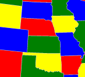

# Quantum Colouring

The colouring problem is when you have an arbitrary map, with countries.
On that graph, you have to colour the countries, such that no two countries which border each other are the same colour.

This program takes an arbitrary map, as a graph, represented as an adjacency dictionary.
Then, it creates a boolean system to represent the valid colouring states.
After, a quantum computer to find the solutions to the boolean system.
In the current case, the number of colours is n=2.

## Files
- `quantumcoloring.py` - main script
- `graph.txt` - input file

## How to use:
To enter an arbitrary graph, change the `graph.txt`. The format is an adjacency dictionary.

## Sources:
- [Python documentation](https://www.python.org/doc/)
- [Qiskit documentation](https://qiskit.org/)
